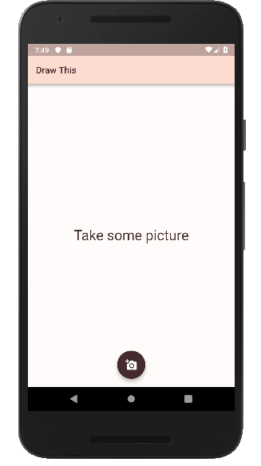
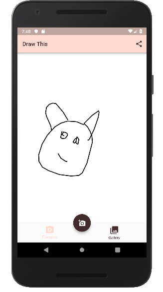
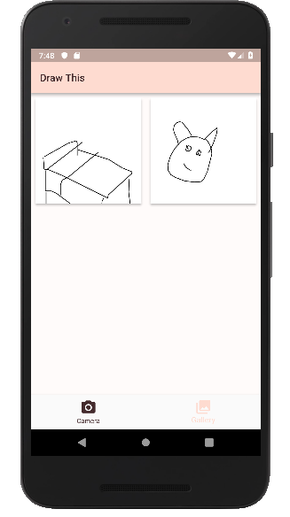

<h1 align="center">Draw This</h1>

## Introducción
En este proyecto se ha realizado una versión para dispositivos móviles del proyecto: https://danmacnish.com/2018/07/01/draw-this de Dan Macnish.

La funcionalidad principal de esta aplicación es tomar una foto y convertirla en un dibujo heho a mano. Como funcionalidades secundarias, la aplicación permite compartir los dibujos realizados y gestionar una pequeña galería de los dibujos realizados.

Los casos de uso soportados por la aplicación son los siguientes:

- Tomar una fotografía y transformarla en un dibujo.

- Compartir un dibujo a través de otras aplicaciones (típicamente redes sociales).

- Mantener una galería con los dibujos realizados.

## Implementación
Este proyecto es una aplicación cliente/servidor convencional, pero únicamente está desarrollada la parte cliente. La parte servidor con la que interactúa se puede encontrar en el siguiente repositorio: https://github.com/nbarreira/cartoonify

La implementación se ha realizadado para la plataforma android, usando el framework *flutter* (https://flutter.dev).

En la carpeta docs se pueden encontrar las priority guides y wireframes realizados, donde se planteo previamente la estructura visual que tendría la aplicación, así como los diagramas de clases de cada módulo y un diagrama de secuencia para el caso de uso "tomar una fotografía y transformarla en un dibujo".

## Aplicación
En las imágenes inferiores se muestra el resultado final de la aplicación.

  
  
  

## Ejecución
La ejecución de la aplicación requiere tener instalado el framework *flutter* (https://flutter.dev) y para que esta funcione correctamente es necesario que la parte servidor esté previamente en funcionamiento. Esta se puede encontrar en el siguiente repositorio: https://github.com/nbarreira/cartoonify
